# 🔰Pythonを触ってみる(環境構築からHelloWorldまで) on VSCode

Pythonで環境のインストールからhelloWorldまでをやってみたメモ。

- Pythonのバージョンは3.6
- windows10
- VSCodeを利用

## 🔰Pythonの公式サイト

- [Python](https://www.python.org/)

## 🔰Pythonの環境構築

Pythonはv2.x or v3.xで色々あるようですが、今回はv3.6を選択。

windowsのパッケージ管理ソフトchocolateyに

- Python3.6

があったのでインストール。

- choco install python

[choco - python](https://chocolatey.org/packages/python)

※chocolatey自体のインストールについては下記

[choco Installation](https://chocolatey.org/install)

chocolateを利用しない場合は公式ドキュメントの[3. Windows で Python を使う](https://docs.python.org/ja/3/using/windows.html#using-python-on-windows)を参照してインストールして下さい。(左上のプルダウンから英語、フランス語、日本語が選択できる)

なおPythonのパッケージ管理ツールであるpipは下記記載のバージョンから標準で同梱されているらしいので、個別に導入という事はしていません。

(実際Pythonをインストールしたディレクトリのscriptsフォルダの中にpip.exeが入ってた)

### pipが標準で同梱

[Requirements for Installing Packages](https://packaging.python.org/tutorials/installing-packages/#requirements-for-installing-packages)

- Python 2 >= 2.7.9
- Python 3 >= 3.4

上記記載のバーションから標準でpipが入っているそうです。ただ、最新にアップデートしろと書いてあるので下記コマンドでアップデートして下さい。

```powershell
pip install -U pip setuptools
```

## 🔰VSCodeのインストール

- [Visual Studio Coce](https://code.visualstudio.com/)からダウンロードしてインストール
- [chocolatey - vscode](https://chocolatey.org/packages/VisualStudioCode)でインストール

お好きな方法でインストールして下さい。

## 🔰VSCodeの拡張機能インストール

VSCodeにPython向けの拡張機能が用意されているのでインストールする。

[vscode extension - Python](https://marketplace.visualstudio.com/items?itemName=donjayamanne.python)

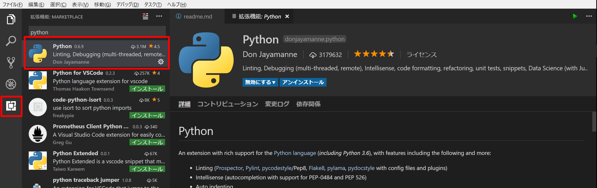

## 🔰pylintのインストール

拡張機能をインストルしてVSCodeでpyファイルをコーディングしようとすると。


というメッセージが出てくるかと思います。

pylintはPythonのコーディングを採点をしてくれるパッケージで。

Pythonの拡張機能をインストールした後に基本設定でPythonの所をみると、pylintを標準で利用するユーザ設定になっている様子。

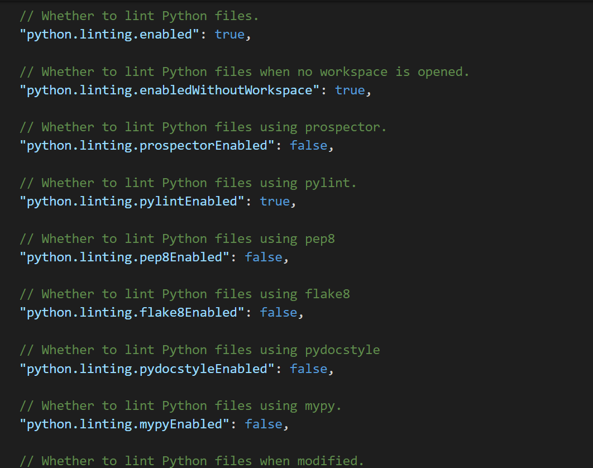

なのでpylintが入っていないと上記のようなエラーが出るようです。

なおエラメッセージの横に出ているinstall pylintボタンを押すと、pip install pylintコマンドが発行されて、pylintがインストールされる。

他のlintが使いたい場合は、適宜インストールして基本設定のパラメータを調整すれば良い。

もちろんpyファイルをコーディングする前にコマンドラインより **pip install pylint** でインストールしてもOK。

## 🔰VSCodeでHelloWorldのコーディング

ファイル -> 新規ファイル作成 (ctrl+N)からファイルを作成して下記をコーディング。

```Python
#!/usr/bin/python3
# -*- coding: utf-8 -*-

#HelloWorldを表示するSampleプログラム
print("Hello World!")

```

## 🔰Pythonは処理ブロックをインデントで記述

Pythonをコーディングする時の特徴的な点として。

- Pythonは処理ブロックをインデントで記述

があり、インデントを省略したり適当にやると動かなくなります。

処理ブロックをインデントで制御するという思想は公式ドキュメントの下記に説明があったりしました。

[デザインと歴史 FAQ](https://docs.python.org/ja/3.6/faq/design.html#design-and-history-faq)

たしかに無秩序にインデントされたコードとか爆発して欲しいですね。

さらに下記のように

> 開始/終了の括弧がないので、構文解析器と人間の読者の間にグループ化の解釈の違いは起こりえません。

とも書いてあるので、Pythonでif文等()を書けるけど書かない例が多いのはこのような思想の元にコーディングされているからなんですかね。

ちなみにVSCodeだとショートカットでShift+Alt+F : Format documentというコードを自動整形してくれる機能があるので積極的に使っていきたい。

## 🔰Pythonのshebang

※**ここらへんの仕組みの前提となるwindows用のPython launcher(py.exe)はPython3.3から導入されている。**

上に記載したhelloworldのPythonプログラムについて、一行目にある

> `#!/usr/bin/python`

は[shebang](https://ja.wikipedia.org/wiki/%E3%82%B7%E3%83%90%E3%83%B3_(Unix))を表していて。

一行目かつ#!で始まるとshebangと認識する。

LINUXやらUNIXやらで意味するものかと思いきや、Using Python on Windowsの[3.4.2. シェバン (shebang) 行](https://docs.python.org/ja/3/using/windows.html#shebang-lines)に

> Python スクリプトのシェバン行を Unix-Windows 間で移植可能にするため、このランチャは、どのインタプリタが使われるかを指定するための大量の 『仮想』 コマンドをサポートしています。サポートされる仮想コマンドには以下のものがあります:
- /usr/bin/env python
- /usr/bin/python
- /usr/local/bin/python
- python

と書いてある。さらに

> 上記の仮想コマンドのいずれでも、明示的にバージョンを指定できます (メジャーバージョンだけでも、メジャー・マイナーバージョン両方でも) - 例えば /usr/bin/python2.7 のように - これによりその特定のバージョンが特定されて使われます。

と記載があるのでバージョン指定もできる。

試しにPython3.6しかインストールされてない環境でshebangで#!/usr/bin/python2と記載したpyファイルを実行してみる。

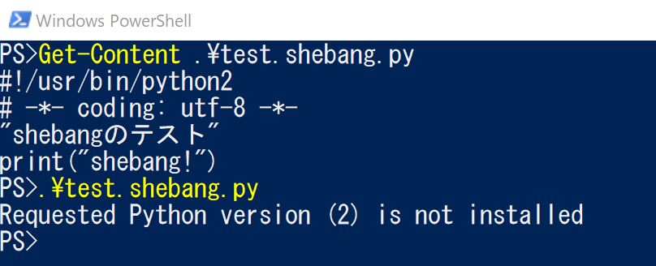

Python version 2がないと言われる。

上記は、test.shebang.pyというファイルの中身をget-contentで確認してから、pyファイルを実行している例。
（Pythonインストール時にpyファイルをpy.exeというPython Launcherに関連づけてくれる。このpy.exeがshebangを解釈してうまいことプログラムが実行される）

今回はPython3.6なので#!/usr/bin/python3と設定。
もっと細かく指定する必要があればshebangを#!/usr/bin/python3.6とかすればよい。

## 🔰ソースファイルのエンコーディング

2行目の

> `# -*- coding: utf-8 -*-`

[2.2.1. ソースコードの文字コード](https://docs.python.org/ja/3/tutorial/interpreter.html#source-code-encoding)にソースコードのエンコーディングについて記載がある。

Pythonソースファイルはデフォルトでutf-8[(PEP 3120)](https://www.python.org/dev/peps/pep-3120/)だが、明示的に記載している。

余談ですがPEP263をみるとPythonのソースファイルにunicodeのBOMがついているとUFT-8だと判断するみたいです。

[PEP 263](https://www.python.org/dev/peps/pep-0263/)

> To aid with platforms such as Windows, which add Unicode BOM marks to the beginning of Unicode files, the UTF-8 signature \xef\xbb\xbf will be interpreted as 'utf-8' encoding as well (even if no magic encoding comment is given).
> If a source file uses both the UTF-8 BOM mark signature and a magic encoding comment, the only allowed encoding for the comment is 'utf-8'. Any other encoding will cause an error.

また[Issue1503789](http://bugs.python.org/issue1503789)をみるとPythonのソースコードはuft16ではコーディングできないようです。

## 🔰ファイルの保存

VSCode画面右下の赤枠の文字コードを確認。
uft-8以外の場合は赤枠の所をクリックするとエンコーディングを選択できるのでuft-8を選択

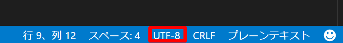

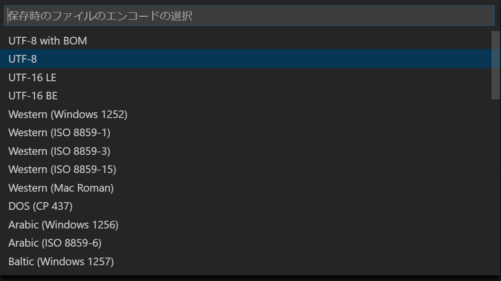

名前を付けて保存で適当な場所にソースを保存して下さい。

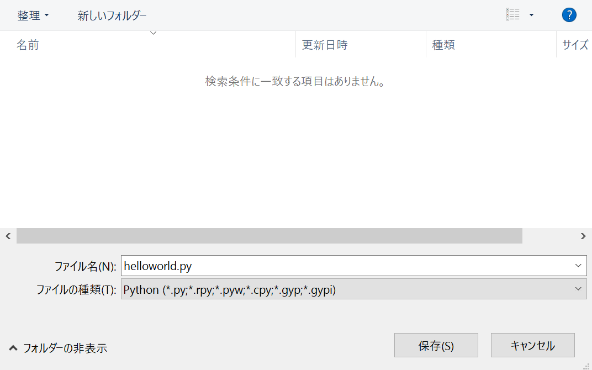

## 🔰pylintでコード採点

せっかくなので保存したファイルをpylintで採点してみる。

pylint ソースコード

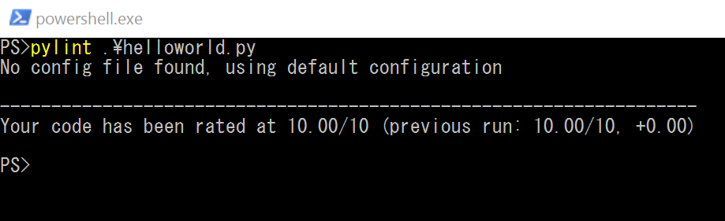

|Global evaluation|
|-----------------|
|Your code has been rated at 10.00/10 (previous run: 10.00/10, +0.00)|

ちなみにVSCodeの問題画面(ctrl+shift+m)にチェック結果が常に表示されていました。
コーディングするたびに動的にチェックしている様子。
（だから前述するpyファイルをコーディングする時にpylintが入ってないってエラーと言われてそう）

## 🔰Pythonプログラムの実行

コマンドラインから**python プログラム名** としても実行できる。

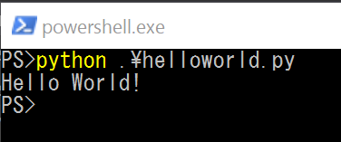

プログラ名のみでも実行できる。
(インストール時に.pyファイルにpy.exeが関連づけられている為)

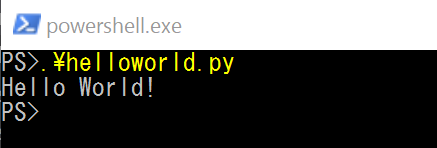

なお、上記の例だといちいちpowershellを起動して実行していますが。

VSCodeのctrl+@で統合ターミナルに画面遷移するのでそちらで実行するのがコーディングしながらだと手早い感じ。

## 🔰Pythonを対話モードで起動してみる

Pythonとコマンド叩くと対話モードで起動する。(処理を抜けるにはexit() or Ctrl-Z）
対話式で逐次処理を行える。

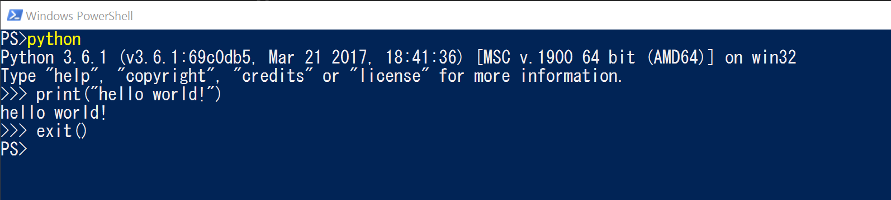

## 🔰VSCodeからデバック実行

デバックからデバックの開始　もしくはデバック画面(ctrl+shift+d)のデバックの開始を押すとデバックが始まる。

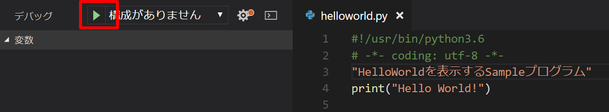

続行（F5)で処理がデバック実行されていき。

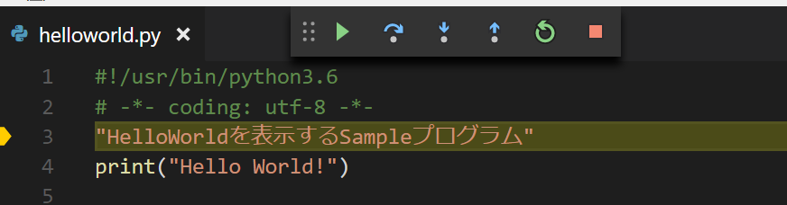

最後まで実行するとデバックコンソールに **Hello World!** と表示される。

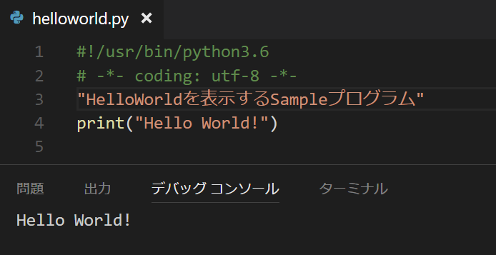

ちなみにVSCodeではlaunch.jsonというファイルを作って、高度なデバック設定（引数渡して実行したり色々）をすることができる。

[vscode - debugging](https://code.visualstudio.com/docs/editor/debugging)に詳細が書いてあります。

こちらの説明は後回しにします。

## 🔰パッケージの利用 pip

[PyPI - the Python Package Index](https://pypi.python.org/pypi)

pythonでは様々なパッケージが公開されており、それらをpip(ある時から標準で同梱されるようになったパッケージマネージャ)を利用することによって手軽に利用できる。

[PyPI](https://pypi.python.org/pypi)でパッケージを探してきて下記のようなinstallコマンドでパッケージを手軽に導入できる。

```powershell
pip.exe install パッケージ名
```

環境にインストールされているパッケージの一覧はlistコマンドで確認ができる。

```powershell
pip.exe list
```

アンインストールする場合は

```powershell
pip.exe uninstall パッケージ名
```

ちなみにdownloadコマンドでパッケージのダウンロードを行い。
そのダウンロードしたファイルを指定してinstallする。なんてこともできる。

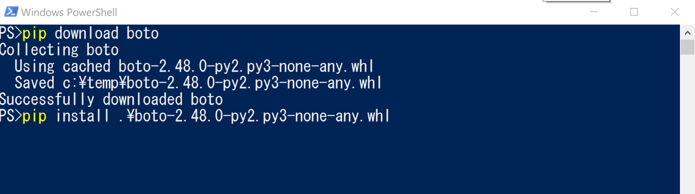

上記の例だとpip download botoでパッケージのダウンロードを行い。
pip installでダウンロードしたファイルを指定してインストールしている。

## 🔰仮想環境 venv

[28.3. venv — 仮想環境の作成](https://docs.python.org/ja/3.6/library/venv.html#module-venv)

Pythonは様々なパッケージが用意されていて、pipコマンドから手軽にインストール出来ますが。
開発環境に無秩序にモジュールを突っ込んでいくと、当然のごとく開発環境がカオスなことになっていきます。

Python3.3からvenvという仮想環境の作成機能が標準で追加されているので、これで仮想環境を作ってそこにパッケージを入れていけば、開発環境が区分けされてカオスなことにはならないでしょう。

仮想環境の作り方としては下記のようなコマンドを実行すればよい。

```powershell
python.exe -m venv <<ENV_DIR>>
```

実行すると、ENV_DIRに仮想環境が作られます。

この仮想環境は作成しただけでは有効にならないので、下記スクリプトを実行して有効にしてあげる必要がある。windowsの場合は下記。

OS|shell|有効化のコマンドファイルがあるパス
---|---|---
Windows|powershell|ENV_DIR\Scripts\activate.bat
Windows|CMD|ENV_DIR\Scripts\Activate.ps1

また有効になっている仮想環境を抜ける場合は、

```powershell
deactivate
```

と実行すれば、環境から抜ける事ができる。

.envという仮想環境を作成、有効化して抜ける一連の流れを行った例。

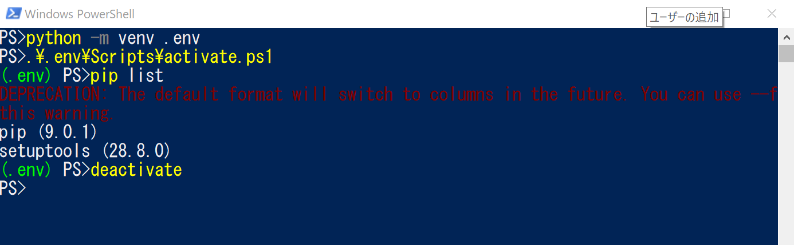

様々なパッケージが乱立する汚染された環境で開発を行うのではなく、対象となる環境を見据えて仮想環境をそれぞれ構築して開発を行っていきたい所です。

## 🔰VSCodeでlaunch.jsonを利用したデバック

VSCodeでただデバック実行するだけでなく。引数を渡してデバック実行をしてみる。

```python
#!/usr/bin/python3
# -*- coding: utf-8 -*-

import sys

print(sys.argv)

```

上記は渡された引数を表示する簡易なプログラムになります。
(argv.pyというファイル名で保存した)

このargv.pyファイルに対してデバック時に引数を渡すようにlaunch.jsonを設定していきます。

まずはデバック画面で**構成の追加**を選択します。

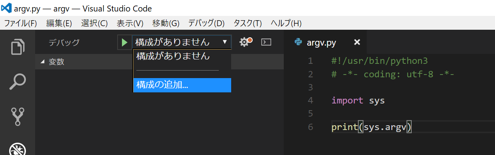

launch.jsonファイルが作成されます。

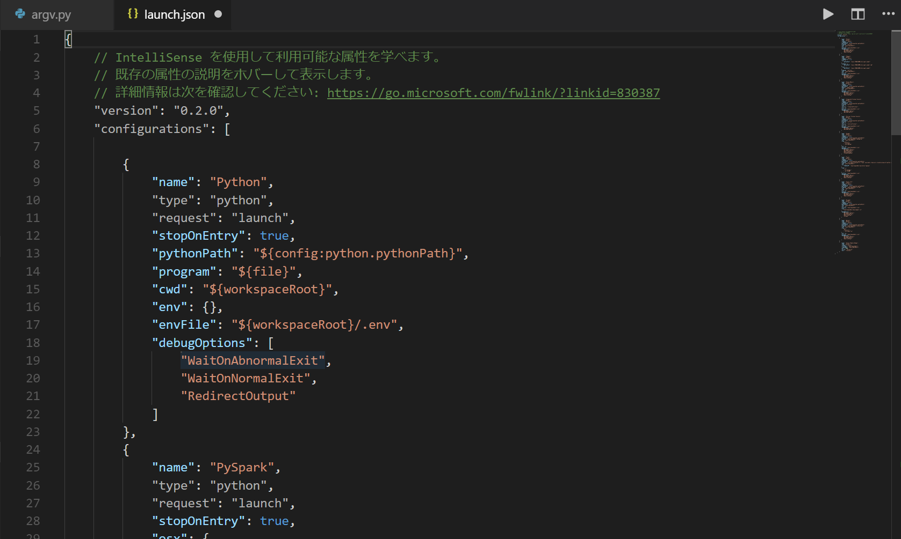

※.pyファイルを開きながら構成の追加をすると、自動的にPythonの構成が追加される。選択してない場合は下記のように構成の言語選択がでるのでPythonを選択する。

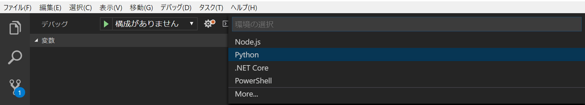

選択しているPythonという部分が、現在VSCodeで開いているファイルをデバックする設定になっていのでこの部分をコピペして改造していく。

Pythonの部分を選択して

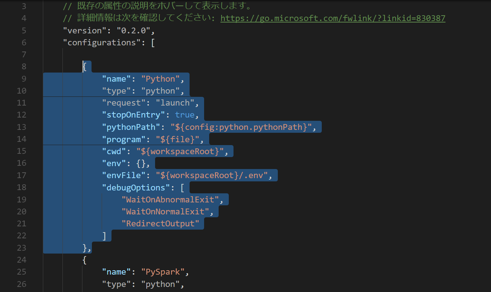

選択した部分の下に追加

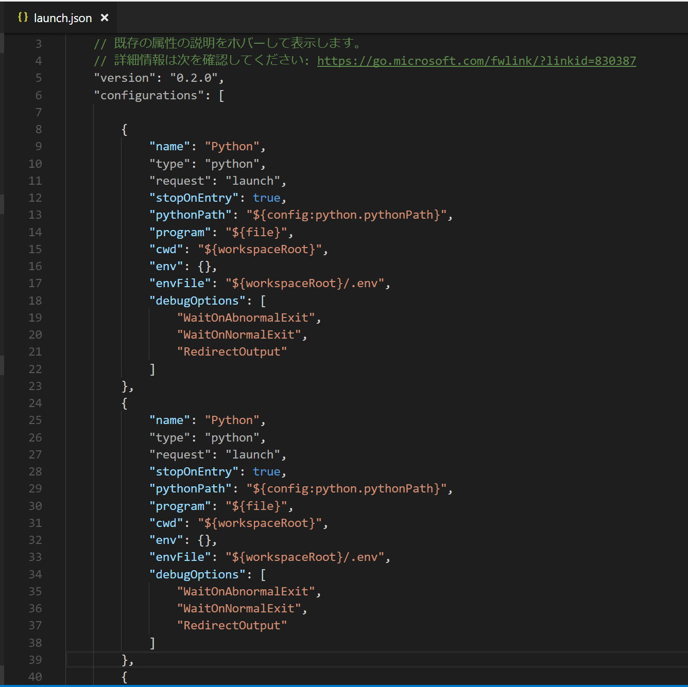

コピペしたPythonの部分を下記のように書き換え

変更箇所

- name argvに変更
- program "program": "${workspaceRoot}/argv.py",に変更
- args 引数の追加 argument001,argument002,argument003

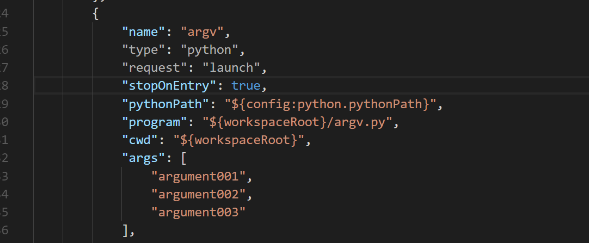

デバックの所を確認するとargvが追加されている。

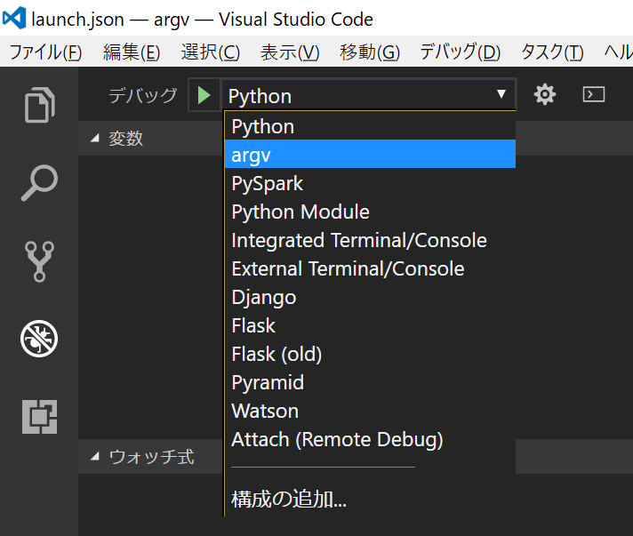

argvを選択してデバック実行。

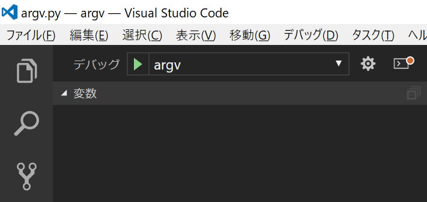

デバック実行される、続行(F5)で処理する。

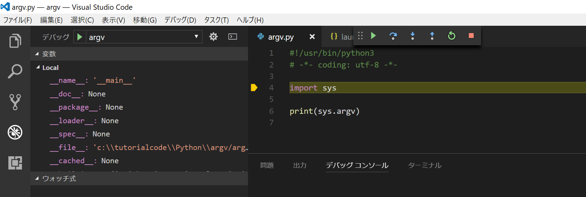

デバックコンソールに下記のように、argv.pyに指定した引数で実行された事が確認できる。

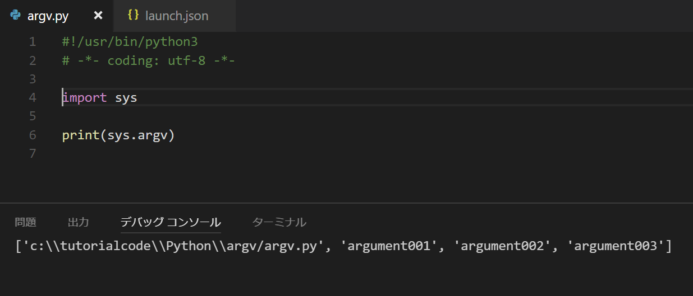

デバックコンソールに下記のように表示され、argv.pyに対して引数がデバック実行されたのがわかる。

この一覧の流れをみると大体想像がつくと思いますが、

- programでデバック実行対象の指定。今回はargv.py
- argsで引数の指定。

を行っています。

${workspaceRoot}はlaunch.jsonで利用できる変数でVSCodeで開いているディレクトリになります。なお使用できる変数一覧は下記に書いてあります。

[Variable substitution](https://code.visualstudio.com/docs/editor/debugging#_variable-substitution)

## 🔰所感

処理ブロックをインデントで管理するというコード記法は最初見慣れなかったが、わりかしなれると思う。

というか、[Python はなぜ文のグループ化にインデントを使うのですか？](https://docs.python.org/ja/3.6/faq/design.html#why-does-python-use-indentation-for-grouping-of-statements)の部分を読んで、Pythonの思想を感じてからコーディングするのが色々と腹に落ちていいかと思います。
